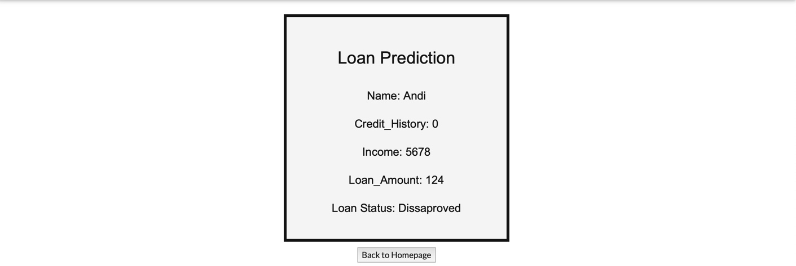

# Purwadhika Job Connector Data Science - Final Project #
## Loan Approval Prediction 

Sumber dataset: [Loan Dataset](https://www.kaggle.com/altruistdelhite04/loan-prediction-problem-dataset) 

### Deskripsi: ###
	
Memprediksi status loan seorang nasabah yang ingin mengajukan pinjaman kredit dengan mengkomparasikan 4 Machine Learning Model: 

1.	Logistic Regression
2.	Random Forest
3.	K - Nearest Neighbors

Feature yang digunakan dalam project ini adalah: 

1.	Gender (Male/Female)
2.	Married (Applicant Married)
3.	Dependents (Number of Dependents)
4.	Education (Applicant Education)
5.	Self Employed (Self Employed)
6.	Applicant Income (Total Applicant Income)
7.	Co-applicant Income (Total Coappplicant Income)
8.	Loan Amount (Total loan amount)
9.	Loan Amount Term (term of loan in months)
10.	Credit History (Credit history)
11.	Property Area  (Urban/Semiurban/Rural)

### App: ###

1. **Homepage**

2. **Loan Prediction

### Kadek Ayu Novita | _novitaprahastha@gmail.com_ ###